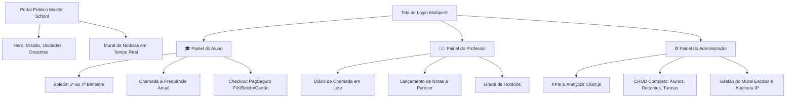

<div align="center">

# 🎓 MASTER SCHOOL ERP
### *Plataforma Educacional Integrada & Sistema de Gestão Escolar Completo*

[](https://php.net/)
[](https://www.mysql.com/)
[](https://www.apachefriends.org/)
[](https://github.com/LeoLemosDevs/Projeto_Escola_ERP)
[](#-segurança--arquitetura-robusta)
[](https://github.com/LeoLemosDevs/Projeto_Escola_ERP/releases)
[](https://github.com/LeoLemosDevs/Projeto_Escola_ERP)

<p align="center">
  <strong>Uma solução full-stack sofisticada que combina um Portal Institucional Web moderno com um poderoso ecossistema ERP acadêmico e financeiro, estruturado sob medida com PHP 8, MySQL e um Design System contemporâneo. Na v3.0.0, toda a identidade visual foi renovada para o padrão <em>Colégio Master</em>: fundo claro, Azul Marinho Real, Laranja Quente e a nova Logomarca Geométrica.</strong>
</p>

[✨ Visão Geral](#-visão-geral-do-projeto) •
[🎨 Identidade Visual](#-identidade-visual--design-system-premium) •
[🚀 Módulos do Sistema](#-principais-módulos--funcionalidades) •
[🛠️ Stack & Arquitetura](#-stack-tecnológica--arquitetura) •
[⚡ Instalação em 60s](#-instalação--execução-em-60-segundos-xampp) •
[🔑 Credenciais Demo](#-credenciais-de-acesso-modo-demo) •
[💡 Para Recrutadores](#-destaques-técnicos-para-recrutadores)

---

</div>

## ✨ Visão Geral do Projeto

O **Master School ERP** foi concebido como um projeto de **nível empresarial e portfólio de excelência**, demonstrando o domínio completo do ciclo de desenvolvimento de software full-stack sem a dependência de frameworks monolíticos.

O sistema divide-se em duas esferas perfeitamente integradas:
1. **🌐 Portal Institucional Público:** Um site de alto padrão para a **Master School** (escola brasileira bilíngue de ensino médio), repleto de animações interativas, mural de comunicados e apresentação da infraestrutura.
2. **🔐 ERP Educacional Multiperfil (Área Restrita):** Um centro de comando escolar seguro com perfis de **Aluno**, **Professor** e **Administrador**, contemplando desde boletins de frequência anual até Analytics em **Chart.js** e checkout financeiro simulado via **PagSeguro**.

---

## 🎨 Identidade Visual & Design System Premium — v3.0.0

A experiência do usuário (UI/UX) foi completamente repaginada na versão **3.0.0** para o padrão **Colégio Master** (inspirado em portais educacionais de excelência como o **Colmaster.com.br**):

- 🌅 **Tema Claro Institucional (`light-body` / `dashboard-light-theme`):** Substituição do dark mode por fundo branco-gelo (`#f8fafc`), cards brancos com bordas suaves `#e2e8f0` e sombras de elevação leves — transmitindo profissionalismo e confiança para os pais e alunos.
- 🔷 **Paleta Colégio Master:** Azul Marinho Real (`#1e3a8a`), Azul Royal Vibrante (`#2563eb`), Laranja Quente (`#f97316`) para CTAs e ênfase, e Branco Puro como superfície base.
- 🏷️ **Logomarca Geométrica Master School:** Criação de um elemento de identidade visual proprietário composto por 4 formas geométricas coloridas (quadrado, arco, círculo e estrela), presente em todas as páginas institucionais e na sidebar do ERP.
- ⚡ **Micro-animações & Responsividade Total:** Navegação com menu lateral em dispositivos móveis, banner pulsante `MATRÍCULAS 2027`, galeria de fotos reais de alunos e eventos com efeito hover.
- 🔤 **Tipografia de Alta Legibilidade:** Fontes **Outfit** (cabeçalhos expressivos) e **Inter** (interfaces e tabelas), com contrastes WCAG corrigidos — texto branco em fundos azuis, texto escuro em fundos claros.

---

## 📋 Histórico de Versões

| Versão | Data | Destaque |
| :--- | :--- | :--- |
| **v1.0.0** | 2026-07 | Fundação: Banco de dados, RBAC, 3 painéis ERP funcionais |
| **v2.0.0** | 2026-07 | Redesign Glassmorphism, formulários premium, backup SQL, credenciais demo |
| **v3.0.0** | 2026-08 | 🌟 **Nova Identidade Visual Clara Institucional** — Logomarca Geométrica, tema Colégio Master em todo o site e painéis ERP, correções de contraste WCAG e warnings PHP |

---


## 🚀 Principais Módulos & Funcionalidades



### 1. 🌐 Portal Institucional (8 Páginas Públicas)
- **Página Inicial (`index.php`):** Hero section animada com chamada de impacto, **Mural Acadêmico** alimentado diretamente pelo banco de dados (recessos, férias, eventos e comunicados) e vitrine de **Alunos Destaques**.
- **Institucional Completo:** Páginas dedicadas à **História da Instituição** (`quem-somos.php`), **Missão, Visão e Valores** (`missao-visao-valores.php`), **Infraestrutura e Campi** (`unidades.php`), **Vitrine Docente** (`professores.php`), **Carreira** (`trabalhe-conosco.php`) e **Ouvidoria** (`contato.php`).

### 2. 🔐 Autenticação Inteligente & Segurança (RBAC)
- **Tela de Login Premium (`login.php`):** Interface com abas visuais para transição rápida entre **Estudante**, **Professor** e **Gestão**.
- **⚡ Modo Demonstração 1-Clique:** Botões interativos de teste rápido no rodapé do login que preenchem automaticamente as credenciais para avaliação em portfólio.
- **Segurança em Camadas:**
  - Consultas protegidas contra Injeção SQL com **Prepared Statements PDO**.
  - Hash criptográfico com **Bcrypt (`password_hash`)**.
  - Controle rigoroso de rotas via Middleware `require_role()`.
  - **Trilha de Auditoria (`system_logs`):** Monitoramento contínuo com gravação do carimbo de tempo, IP do cliente, usuário e ação executada.

### 3. 🎓 Módulo Estudante (Aluno)
- **Boletim Consolidado:** Apresentação das notas do 1º ao 4º Bimestre (0 a 10) e média final com destaque visual, acompanhadas de **observações pedagógicas** personalizadas pelo professor.
- **Controle de Assiduidade:** Histórico da chamada anual indicando percentual de frequência, presenças, faltas e justificativas.
- **💳 Checkout PagSeguro Simulado (`aluno/financeiro.php`):**
  - Modal interativo programado em Vanilla JS (`payment.js`) reproduzindo a experiência real de pagamento online.
  - Abas funcionais para pagamento instantâneo via **PIX** (com geração de QR Code e código *Copia e Cola*), **Boleto Bancário** (linha digitável e PDF) ou **Cartão de Crédito** (até 12x).
  - Quitação de mensalidades com baixa em tempo real e atualização de status na base de dados.

### 4. 👨‍🏫 Módulo Docente (Professor)
- **Diário de Chamada em Lote (`professor/chamada.php`):** Seleção ágil por turma, disciplina e data da aula. Contém botão de atalho **"✔ Marcar Todos Presentes"** e salva chamadas usando operação atômica de `UPSERT` no MySQL.
- **Lançamento de Avaliações (`professor/notas.php`):** Interface otimizada para digitação de notas bimestrais e inserção de parecer descritivo por aluno.
- **Grade Curricular (`professor/horarios.php`):** Visualização de horários de aula, turnos e salas do corpo docente.

### 5. ⚙️ Módulo de Gestão Geral (Administrador)
- **Centro de Comando & KPIs (`admin/index.php`):** Painel de bordo com métricas em tempo real (Total de Alunos, Professores, Turmas, Receita Paga e a Receber).
- **📊 Analytics Interativos com Chart.js:**
  - *Gráfico de Barras:* Desempenho Geral por Disciplina (média cumulativa do 1º ao 4º Bimestre).
  - *Gráfico de Rosca:* Distribuição Financeira (mensalidades pagas vs. pendentes vs. em atraso).
- **CRUD Completo de Gestão Escolar:**
  - Gestão total de **Estudantes** (`admin/alunos.php`), **Corpo Docente** (`admin/professores.php`), **Turmas & Grades** (`admin/turmas.php`) e do **Mural da Página Inicial** (`admin/noticias.php`).
  - Painel de visualização da **Trilha de Auditoria do Sistema** (`admin/logs.php`).

---

## 🛠️ Stack Tecnológica & Arquitetura

O projeto foi edificado seguindo padrões de engenharia de software limpos, separação de responsabilidades e foco em performance:

| Camada | Tecnologia | Detalhes & Aplicação |
| :--- | :--- | :--- |
| **Linguagem Backend** | **PHP 8+** | PHP Orientado a Objetos e Estruturado, sessões seguras e sanitização de dados |
| **Banco de Dados** | **MySQL / MariaDB** | Modelagem relacional 3NF com 10 tabelas, chaves estrangeiras (`FK`) e integridade referencial |
| **Camada de Dados** | **PHP PDO** | Abstração de banco de dados com `Prepared Statements` (Prevenção SQL Injection) |
| **Design / Frontend** | **Vanilla CSS Moderno** | Design System em tokens CSS (`design-system.css`), variáveis HSL e layouts CSS Grid/Flexbox |
| **Interatividade** | **Vanilla JS ES6+** | Modais responsivos, animações DOM, feedback Toast e lógica de checkout |
| **Visualização de Dados** | **Chart.js 4.x** | Biblioteca gráfica para exibição de métricas analíticas executivas |
| **Servidor & Ambiente** | **Apache / XAMPP** | Pronto para rodar em servidores locais XAMPP, WAMP, Laragon ou ambientes Linux/Docker |

### 📂 Estrutura de Pastas do Repositório

```bash
Projeto_Escola_ERP/
├── 📁 config/
│   ├── config.php                 # Helpers globais, constantes, sanitização e logs de auditoria
│   └── database.php               # Conexão PDO com auto-criação do banco relacional
├── 📁 database/
│   └── schema.sql                 # Script DDL + DML com 10 tabelas e dados de demonstração
├── 📁 assets/
│   ├── 📁 css/
│   │   ├── design-system.css      # Design tokens, modo escuro/claro e estilos Glassmorphic
│   │   ├── style.css              # Estilização das 8 páginas públicas institucionais
│   │   └── dashboard.css          # Layout unificado da área restrita do ERP (Sidebar/Topbar)
│   └── 📁 js/
│       ├── main.js                # Lógica de gaveta móvel (drawer), modais e toasts
│       └── payment.js             # Simulador de checkout PagSeguro (PIX, Boleto e Cartão)
├── 📁 includes/
│   ├── header.php / footer.php    # Templates globais públicos
│   ├── auth_check.php             # Middleware RBAC (proteção de rotas require_role)
│   └── dashboard_header.php       # Menu lateral dinâmico baseado no perfil do usuário
├── 📁 admin/                      # Módulo Administração Geral (Analytics Chart.js, CRUDs, Logs)
├── 📁 professor/                  # Módulo Docente (Chamada em lote, Notas bimestrais, Grade)
├── 📁 aluno/                      # Módulo Estudante (Boletim online, Frequência, Checkout)
├── 📄 index.php                   # Portal Principal (Hero animado, Destaques, Mural)
├── 📄 login.php                   # Autenticação multiperfil com atalhos de demonstração
├── 📄 install.php                 # Instalador Web Interativo 1-Clique do Banco de Dados
└── 📄 README.md                   # Documentação oficial do projeto
```

---

## ⚡ Instalação & Execução em 60 Segundos (XAMPP)

O projeto possui um **Instalador Web 1-Clique** que cria o banco de dados e insere todos os registros de demonstração sem que você precise digitar um único comando SQL!

### Passo 1: Copiar o Projeto
Com o **XAMPP** instalado no Windows, copie ou clone esta pasta para o diretório de publicação web:
```bash
C:\xampp\htdocs\Projeto_Escola_ERP
```
*(Nota: Os links simbólicos/junções também permitem acessar por `http://localhost/master-school`)*

### Passo 2: Iniciar os Serviços
Abra o **Painel de Controle do XAMPP** e clique em **Start** nos módulos:
- 🟢 **Apache**
- 🟢 **MySQL**

### Passo 3: Executar o Instalador 1-Clique no Navegador
Abra o navegador e acesse a página de instalação:
```url
http://localhost/Projeto_Escola_ERP/install.php
```
Clique no botão azul **"🚀 INSTALAR / RESETAR BANCO DE DADOS DA MASTER SCHOOL"**.
> ✔️ O instalador construirá o banco `master_school_erp`, criará todas as 10 tabelas relacionais (`usuarios`, `alunos`, `professores`, `turmas`, `disciplinas`, `notas`, `frequencias`, `mensalidades`, `noticias_eventos`, `system_logs`) e irá popular em menos de 2 segundos um ecossistema com **500 Alunos (do G1 da Educação Infantil ao Ensino Médio Completo)**, **10 Professores com matérias diferentes**, **20 Turmas**, **80 Disciplinas** e **2.000 Mensalidades** (Pix, Boleto, Cartão e Inadimplência) prontas para demonstração!

---

## 🔑 Credenciais de Acesso (Modo Demo)

Você pode avaliar o ERP testando **qualquer um dos perfis**. Na tela de login (`/login.php`), utilize os **botões de preenchimento rápido no rodapé** ou confira a tabela resumida abaixo. Para o roteiro completo com **1 Admin, 3 Professores e 5 Alunos de turmas variadas**, consulte o documento oficial: **[`doc/CREDENCIAIS_DE_TESTE.md`](./doc/CREDENCIAIS_DE_TESTE.md)**.

| Perfil de Acesso | E-mail Institucional | Senha Padrão | Módulo Principal | Acesso Direto |
| :--- | :--- | :--- | :--- | :--- |
| 🎓 **Estudante (Aluno)** | `lucas.mendes@aluno.masterschool.edu.br` | `aluno123` | Boletim, Frequência, PagSeguro | [`/aluno/index.php`](http://localhost/Projeto_Escola_ERP/aluno/index.php) |
| 👨‍🏫 **Professor(a)** | `carlos.silva@masterschool.edu.br` | `prof123` | Diário em Lote, Notas 1-4 Bimestre | [`/professor/index.php`](http://localhost/Projeto_Escola_ERP/professor/index.php) |
| ⚙️ **Admin (Direção)** | `admin@masterschool.edu.br` | `admin123` | Gráficos Chart.js, CRUDs, Auditoria | [`/admin/index.php`](http://localhost/Projeto_Escola_ERP/admin/index.php) |

---

## 📚 Central de Documentação Técnica (`/doc`)

Toda a documentação arquitetural, guias de usuário e manuais técnicos do projeto estão estruturados na pasta **[`/doc`](./doc/INDEX.md)**:

| Guia / Módulo | Descrição do Documento |
| :--- | :--- |
| 🔑 **[`doc/CREDENCIAIS_DE_TESTE.md`](./doc/CREDENCIAIS_DE_TESTE.md)** | Credenciais oficiais de teste para 1 Admin, 3 Professores (disciplinas diferentes) e 5 Alunos (turmas de G1 a Ensino Médio). |
| 🏗️ **[`doc/ARQUITETURA.md`](./doc/ARQUITETURA.md)** | Arquitetura SSR do PHP 8, segurança OWASP (PDO/XSS), Bcrypt e Middleware RBAC. |
| 🗄️ **[`doc/BANCO_DE_DADOS.md`](./doc/BANCO_DE_DADOS.md)** | Modelo Relacional 3NF, Diagrama ER (MER/DER) das 10 tabelas e atomicidade (`UPSERT`). |
| 📘 **[`doc/MANUAL_USUARIO.md`](./doc/MANUAL_USUARIO.md)** | Passo a passo de uso e fluxos para Estudantes, Docentes e Gestão Escolar. |
| ⚙️ **[`doc/GUIA_INSTALACAO_XAMPP.md`](./doc/GUIA_INSTALACAO_XAMPP.md)** | Manual estendido de instalação (Windows XAMPP/WAMP/Laragon e Linux). |
| 🎨 **[`doc/DESIGN_SYSTEM.md`](./doc/DESIGN_SYSTEM.md)** | Tokens CSS, variáveis de cor HSL, Glassmorphism e navegação mobile responsiva. |
| 💳 **[`doc/API_PAGSEGURO_CHECKOUT.md`](./doc/API_PAGSEGURO_CHECKOUT.md)** | Funcionamento do modal Sandbox interativo (PIX QR Code, Boleto, Cartão 12x). |
| 🏆 **[`doc/WALKTHROUGH_ENTREGA.md`](./doc/WALKTHROUGH_ENTREGA.md)** | Histórico das 7 fases de entrega e roteiro prático para verificação do portfólio. |

---

## 💡 Destaques Técnicos para Recrutadores

Se você está avaliando este repositório para uma **oportunidade profissional ou técnica**, observe os seguintes diferenciais arquiteturais do projeto:
1. **Domínio de PHP Puro sem Boilerplate:** Demonstração prática de organização de código PHP 8 com separação clara de responsabilidades, reutilização de layouts via `includes/` e estruturação de funções de utilidade.
2. **Design System Proprio (Zero Dependências de CSS Monolítico):** Todo o sistema visual foi construído a partir do zero utilizando variáveis CSS (`HSL`), flexbox, grid e técnicas modernas de *Glassmorphism*, garantindo alta performance no tempo de carregamento.
3. **Padrão de Segurança Enterprise:** Middleware `require_role()` protegendo arquivos internos contra acesso não autorizado de nível hierárquico inferior, prevenção ativa contra Injeção SQL em 100% das queries via PDO e senhas criptografadas.
4. **Engenharia de Usabilidade:** Criação de facilitadores para portfólio como o **Instalador Web 1-Clique (`install.php`)** e os **Botões de Preenchimento Demo no Login**, permitindo que qualquer avaliador teste a aplicação em segundos.
5. **Integrações Práticas:** Módulo financeiro com simulação realista de **PagSeguro (PIX, Boleto e Cartão)** e visualização analítica com **Chart.js**.

---

<div align="center">

### 🏆 Master School ERP — Excelência em Engenharia de Software & Design Digital
**Desenvolvido como Projeto de Portfólio Full-Stack** • **Todos os direitos reservados © 2026**

[](https://github.com/LeoLemosDevs/Projeto_Escola_ERP)
[](https://php.net/)

</div>
