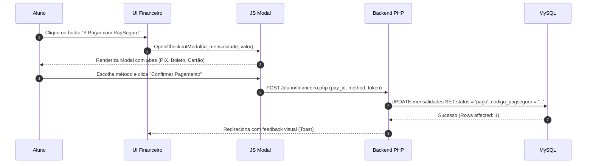

# 💳 Integração Financeira — Checkout Simulado PagSeguro

O módulo financeiro do aluno (`aluno/financeiro.php`) e os relatórios gerais (`admin/financeiro.php`) possuem uma camada de simulação interativa que reproduz o comportamento da API do **PagSeguro Checkout Sandbox**.

---

## 1. Arquitetura da Solução Sandbox

Toda a transação ocorre em um ambiente controlado e seguro para avaliação de portfólio sem envolver cartões bancários reais.

---

## 2. Métodos de Pagamento Disponíveis

- **💠 PIX Instantâneo:** Geração de QR Code visual em base64 e código texto de simulação de Copia-e-Cola (`00020126580014br.gov.bcb.pix...`).
- **📄 Boleto Bancário:** Apresentação de Linha Digitável formatada no padrão bancário brasileiro (`34191.79001 01043.510047...`) e link para download simulado em PDF.
- **💳 Cartão de Crédito:** Formulário com validação de máscara no cliente e parcelamento automático em até **12x sem juros**.

---

## 3. Segurança da Transação

1. **Verificação de Titularidade:** O script `aluno/financeiro.php` checa através do ID de sessão (`$_SESSION['user_id']`) se o título a ser quitado pertence ao aluno logado na tabela `alunos`.
2. **Geração de Referência:** Cada pagamento concluído emite um código hexadecimal aleatório simulando o NSU/Código de Transação PagSeguro (ex: `PAG-8A9E3C1B`), que é persistido no banco e exibido na trilha de auditoria e no extrato do administrador.
