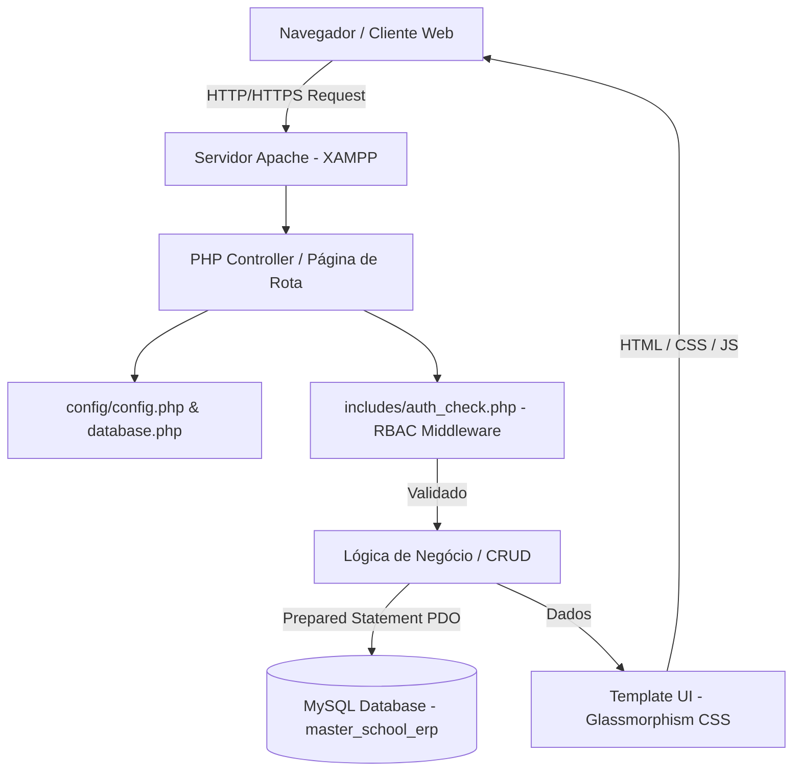

# 🏗️ Arquitetura do Sistema — Master School ERP

Esta documentação descreve a arquitetura de software, o fluxo de requisições e as decisões de engenharia adotadas no desenvolvimento do **Master School ERP**.

---

## 1. Visão Geral Arquitetural

O **Master School ERP** adota uma arquitetura modular em **PHP 8** centrada em páginas (*Page-Controller*) com renderização no servidor (SSR - *Server-Side Rendering*) e camadas de segurança compartilhadas por inclusão de módulos em `includes/` e `config/`.



---

## 2. Camada de Controle de Acesso (RBAC & Segurança)

O sistema implementa o padrão **Role-Based Access Control (RBAC)** através de um middleware em `includes/auth_check.php`.

### Funções Principais do Middleware:
- `is_logged_in()`: Verifica se a sessão ativa contém as credenciais (`$_SESSION['user_id']`).
- `get_user_role()`: Retorna a função do usuário (`admin`, `professor`, `aluno`).
- `require_role($allowedRoles)`: Impede o acesso e redireciona automaticamente caso a role ativa não corresponda às permissões exigidas pela rota.
- `log_system_action($pdo, $userId, $action)`: Grava trilhas de auditoria contendo carimbo de tempo, IP do cliente (`$_SERVER['REMOTE_ADDR']`) e descrição da ação na tabela `system_logs`.

---

## 3. Segurança Contra Vulnerabilidades (OWASP)

- **SQL Injection:** 100% das consultas ao banco de dados utilizam **PHP PDO com Prepared Statements** (`$stmt->prepare()` e `$stmt->execute($params)`). Nenhuma variável de entrada do usuário é concatenada em string SQL.
- **Cross-Site Scripting (XSS):** Todas as saídas dinâmicas no HTML são sanitizadas com `htmlspecialchars($val, ENT_QUOTES, 'UTF-8')` ou através do helper global `sanitize_input()`.
- **Armazenamento de Senhas:** Hashes criptográficos gerados via `password_hash($senha, PASSWORD_BCRYPT)` e validados via `password_verify()`.

---

## 4. Estrutura Modular de Arquivos

```
Projeto_Escola_ERP/
├── config/             # Configurações globais, helpers, fuso horário e logs
├── database/           # DDL relacional (schema.sql) e seeders
├── assets/             # Design System (tokens CSS, paleta HSL, JavaScript, Payment Sandbox)
├── includes/           # Layouts globais (Header/Footer públicos e do ERP) + Middleware RBAC
├── admin/              # Módulo do Administrador (KPIs, Chart.js, CRUD Alunos, Docentes, Turmas, Mural)
├── professor/          # Módulo do Docente (Diário de Chamada em lote, Notas 1-4 Bim, Grade)
├── aluno/              # Módulo do Estudante (Boletim escolar, Frequência %, PagSeguro PIX/Boleto/Cartão)
└── doc/                # Documentação técnica completa e organizada
```

---

## 5. Visualização Executiva (Chart.js 4.x)

O painel de bordo executivo (`admin/index.php`) consome o banco de dados via agregação SQL (`AVG`, `SUM`, `COUNT`, `GROUP BY`) e injeta os datasets JSON diretamente nas instâncias do **Chart.js** para visualização analítica sem recarregamento de página.
