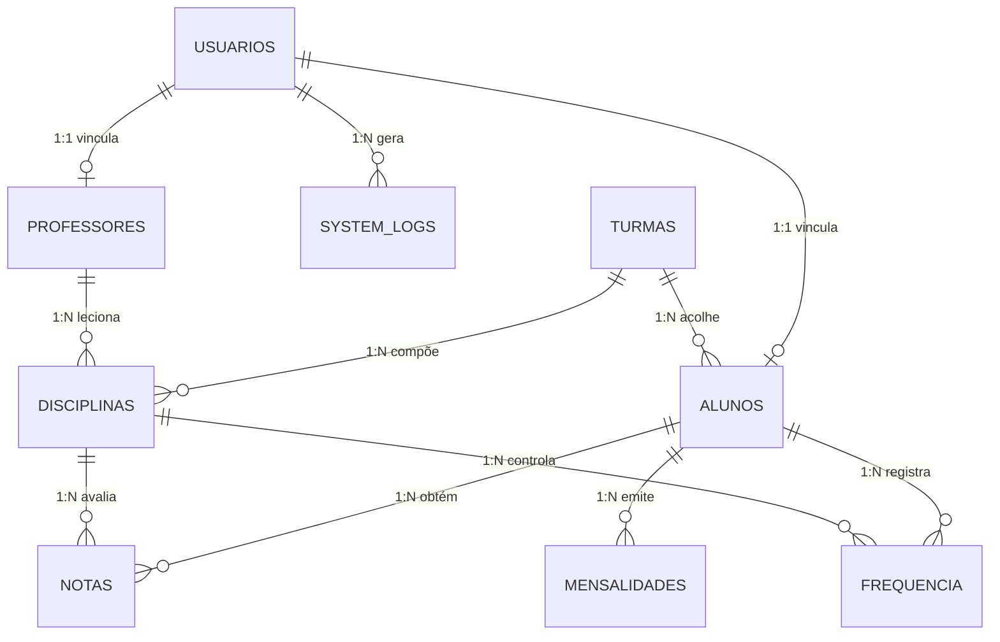

# 🗄️ Modelo Relacional e Banco de Dados — Master School ERP

O banco de dados **`master_school_erp`** é estruturado no modelo relacional normalizado na 3ª Forma Normal (3NF), operando sob a engine **InnoDB** do MySQL/MariaDB para garantir transações atômicas (`ACID`) e integridade referencial por chaves estrangeiras (`FOREIGN KEY`).

---

## 1. Diagrama Entidade-Relacionamento (DER / MER)



---

## 2. Dicionário de Tabelas (DDL & Finalidade)

| Tabela | Chave Primária | Principais Campos | Função / Relacionamento |
| :--- | :--- | :--- | :--- |
| **`usuarios`** | `id (INT PK)` | `nome`, `email`, `senha_hash`, `role` | Central de identidade, autenticação BCRYPT e controle RBAC (`aluno`, `professor`, `admin`). |
| **`alunos`** | `id (INT PK)` | `usuario_id (FK)`, `matricula`, `cpf`, `turma_id (FK)` | Ficha cadastral e acadêmica dos estudantes. |
| **`professores`** | `id (INT PK)` | `usuario_id (FK)`, `especialidade`, `titulacao` | Perfil docente e titulação acadêmica. |
| **`turmas`** | `id (INT PK)` | `nome`, `ano`, `turno`, `sala` | Organização de anos escolares (1ª, 2ª, 3ª série EM) e turnos. |
| **`disciplinas`** | `id (INT PK)` | `codigo`, `nome`, `turma_id (FK)`, `professor_id (FK)` | Matérias lecionadas no ano letivo e docente responsável. |
| **`notas`** | `id (INT PK)` | `aluno_id (FK)`, `disciplina_id (FK)`, `bimestre`, `nota`, `comentario` | Registro de notas (0 a 10) do 1º ao 4º Bimestre e feedback descritivo. |
| **`frequencia`** | `id (INT PK)` | `aluno_id (FK)`, `disciplina_id (FK)`, `data_aula`, `status` | Controle diário de assiduidade (`presente`, `ausente`, `justificado`). |
| **`mensalidades`** | `id (INT PK)` | `aluno_id (FK)`, `valor`, `vencimento`, `status`, `codigo_pagseguro` | Gestão de pagamentos, integração PagSeguro Sandbox e inadimplência. |
| **`noticias`** | `id (INT PK)` | `titulo`, `resumo`, `conteudo`, `categoria`, `destaque` | Comunicados escolares, eventos e recessos exibidos na Home pública. |
| **`system_logs`** | `id (INT PK)` | `usuario_id (FK)`, `acao`, `ip_address`, `criado_em` | Trilha de auditoria de segurança de todas as transações e acessos do ERP. |

---

## 3. Atomicidade em Lançamentos (UPSERT SQL)

Para o lançamento do **Diário de Chamada em Lote** (`professor/chamada.php`) e das **Notas Bimestrais** (`professor/notas.php`), o sistema emprega a instrução SQL `ON DUPLICATE KEY UPDATE` com restrição de chave única composta:

```sql
ALTER TABLE frequencia ADD UNIQUE KEY uk_aluno_disc_data (aluno_id, disciplina_id, data_aula);
ALTER TABLE notas ADD UNIQUE KEY uk_aluno_disc_bim (aluno_id, disciplina_id, bimestre);
```

Este padrão garante que o docente possa reabrir um diário de aula existente e atualizar os dados sem gerar registros duplicados ou erros de violação de chave.
