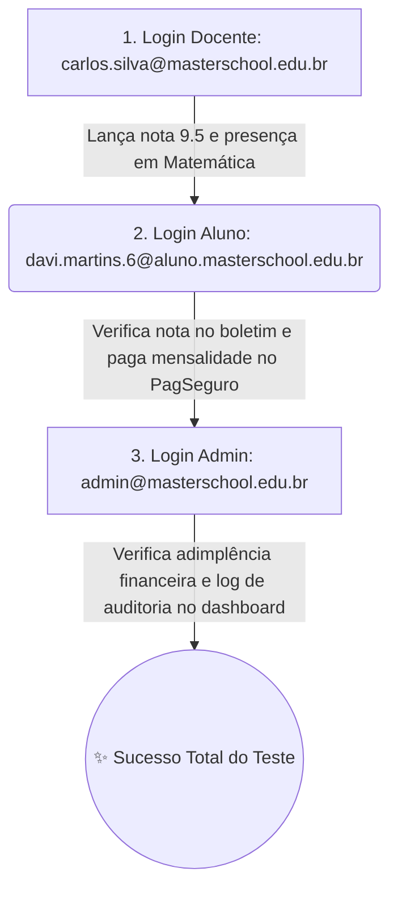

# 🔑 Credenciais de Teste & Contas de Demonstração — Master School ERP

> **Guia Rápido de Acesso:** Este documento apresenta as **credenciais de teste oficiais** para demonstração de todas as funcionalidades, perfis de controle de acesso (RBAC) e fluxos acadêmicos/financeiros do sistema **Master School ERP**.

---

## 🌐 Portal de Login Unificado

O acesso a qualquer perfil do ERP (Estudante, Docente ou Direção Administrativa) é realizado pelo **Portal Educacional de Login Unificado**:

- 🔗 **URL Local de Acesso (XAMPP):** [`http://localhost/Projeto_Escola_ERP/login.php`](http://localhost/Projeto_Escola_ERP/login.php)
- 🔒 **Mecanismo de Segurança:** Todas as senhas estão criptografadas no banco de dados MySQL utilizando algoritmo **PHP `Bcrypt`** (`password_hash`).

---

## ⚙️ 1. Administração Geral (Direção Escolar)

A conta de **Administrador** possui acesso irrestrito ao painel de gestão (`/admin/index.php`), permitindo gerenciar matrículas, turmas, disciplinas, mural de notícias, balanço financeiro global e auditoria de logs de segurança.

| Perfil | Nome do Usuário / Cargo | E-mail de Login | Senha de Acesso | Acesso Principal |
| :---: | :--- | :--- | :---: | :---: |
| **Admin** | **Administração Geral (Direção)** | `admin@masterschool.edu.br` | `admin123` | [`/admin/index.php`](http://localhost/Projeto_Escola_ERP/admin/index.php) |

> [!TIP]
> **O que testar como Admin:**
> 1. Verifique os **Gráficos Chart.js** de adimplência financeira e frequência geral.
> 2. Acesse **Alunos & Matrículas** e experimente o formulário retrátil de nova matrícula.
> 3. No **Mural Escolar**, publique um novo comunicado ou evento com destaque interativo.

---

## 👨‍🏫 2. Corpo Docente (3 Professores de Matérias Distintas)

As contas de **Professores** têm acesso ao Portal Docente (`/professor/index.php`), onde realizam chamadas com diário eletrônico (`UPSERT`), lançam notas bimestrais (1º ao 4º Bimestre) e consultam suas disciplinas vinculadas.

| # | Nome do Docente | Especialidade / Disciplina | E-mail de Login | Senha |
| :---: | :--- | :--- | :--- | :---: |
| **1** | **Prof. Dr. Carlos Silva** | Matemática Avançada & Geometria | `carlos.silva@masterschool.edu.br` | `prof123` |
| **2** | **Profa. Me. Ana Souza** | Literatura Brasileira & Redação | `ana.souza@masterschool.edu.br` | `prof123` |
| **3** | **Prof. Me. Roberto Mendes** | Física Teórica & Laboratório | `roberto.mendes@masterschool.edu.br` | `prof123` |

> [!NOTE]
> **O que testar como Professor:**
> 1. No portal docente, clique em **Fazer Chamada / Presença**, escolha uma turma e salve presenças com justificativa.
> 2. Acesse **Lançar Notas (1º a 4º Bimestre)**, selecione a disciplina do professor e insira notas e comentários pedagógicos.

---

## 🎓 3. Estudantes Matriculados (5 Alunos de Turmas Diversas)

Abaixo estão selecionados **5 alunos representativos** cobrindo todas as etapas educacionais do colégio (da **Educação Infantil - G1** até o **Ensino Médio - 3ª Série**), permitindo testar o Portal do Aluno (`/aluno/index.php`), boletim de notas, histórico de frequência e pagamento de mensalidades.

| # | Nome do Estudante | Matrícula | Turma / Nível Escolar | E-mail de Login | Senha |
| :---: | :--- | :---: | :--- | :--- | :---: |
| **1** | **Lucas Mendes (Aluno Demo)** | `MS2026001` | **G1 — Educação Infantil (Toddlers)** | `lucas.mendes@aluno.masterschool.edu.br` | `aluno123` |
| **2** | **Beatriz Lima (Aluna Demo)** | `MS2026002` | **G2 — Educação Infantil (Nursery)** | `beatriz.lima@aluno.masterschool.edu.br` | `aluno123` |
| **3** | **Davi Martins** | `MS2026006` | **1º Ano — Ensino Fundamental I** | `davi.martins.6@aluno.masterschool.edu.br` | `aluno123` |
| **4** | **Daniel Fernandes** | `MS2026011` | **6º Ano — Ensino Fundamental II** | `daniel.fernandes.11@aluno.masterschool.edu.br` | `aluno123` |
| **5** | **Vinicius Rocha** | `MS2026020` | **3ª Série — Ensino Médio - B** | `vinicius.rocha.20@aluno.masterschool.edu.br` | `aluno123` |

> [!IMPORTANT]
> **O que testar como Aluno:**
> 1. Navegue até **Minhas Mensalidades / Financeiro** e clique em **"Pagar Agora (PIX / Boleto / Cartão)"** para abrir o modal do **Sandbox PagSeguro**.
> 2. Consulte o **Boletim de Notas e Frequência** com cálculo de situação ("Aprovado", "Recuperação" ou "Reprovado").
> 3. No menu **Meu Perfil**, altere a senha ou dados de contato.

---

## 💡 Roteiro Completo de Demonstração de Ponta a Ponta

Para impressionar recrutadores, gestores escolares ou avaliadores em uma apresentação, siga este roteiro de 3 passos:

1. **Passo 1 (Docente):** Logue como `carlos.silva@masterschool.edu.br` (senha: `prof123`). Lance uma presença e uma nota para o aluno da sua turma de Matemática.
2. **Passo 2 (Estudante):** Saia e logue com um dos alunos acima, como `davi.martins.6@aluno.masterschool.edu.br` (senha: `aluno123`). Verifique no boletim a nota recém-lançada e teste o checkout financeiro.
3. **Passo 3 (Direção):** Saia e logue como `admin@masterschool.edu.br` (senha: `admin123`). Visualize o balanço financeiro atualizado e confira em **Auditoria & Logs** o registro em tempo real de todas as ações feitas nas etapas 1 e 2.

---

## 📚 Outros Guias da Documentação

* 👉 **[Voltar ao Índice de Documentação (`INDEX.md`)](./INDEX.md)**
* 👉 **[Ler o Manual do Usuário Completo (`MANUAL_USUARIO.md`)](./MANUAL_USUARIO.md)**
* 👉 **[Consultar a Arquitetura do Sistema (`ARQUITETURA.md`)](./ARQUITETURA.md)**
* 👉 **[Voltar para a Página Principal do Portfólio (`../README.md`)](../README.md)**
